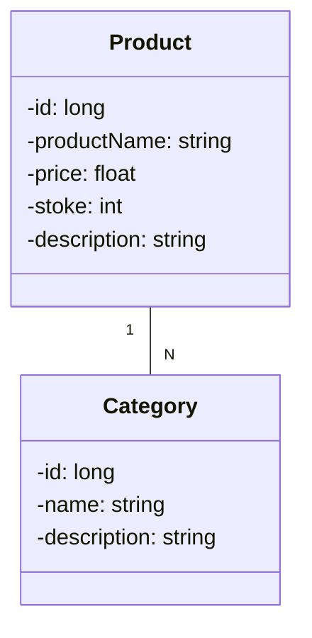

# Desafio para o bootcamp da DIO com a Claro.
## Laboratório para o desenvolvimento de um sistema de cadastro de produtos

## Principais Tecnologias
- **Java 17**: Utilizei uma versão LTS do Java;
- **Spring Boot 3**: Utilizei a versão 3 do Spring Boot;
- **Spring Data JPA**: Ferramenta para simplificar a camada de acesso aos dados, facilitando a integração com bancos de dados SQL;
- **OpenAPI (Swagger)**: Criei a documentação da APIde modo eficaz e fácil de entender usando a OpenAPI (Swagger);

### Diagrama de classes:
